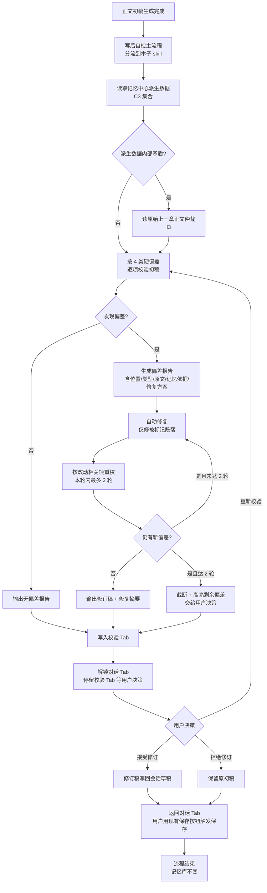

# 正文初稿校验与验证 — 设计文档

> 分支：`jiaoyanyuzhengzheng`
> 创建日期：20260705
> 状态：待用户审阅 → 进入实现规划

## 一、目标与范围

### 1.1 目标

在 AI 会话工作流的"正文生成"阶段之后，自动追加一个"校验与验证"子流程。该流程读取项目记忆中心里**已有角色**的"应当如此"信息，对照本次刚生成的正文初稿，审查是否存在硬偏差；若有偏差则**先报告后自动修复**，再**针对改动项重校最多 2 轮**，最终把校验结论、修订前后对比呈现到独立的"校验"Tab，供用户决定接受 / 拒绝 / 重新校验。

### 1.2 范围（In Scope）

- 范畴限定为"硬偏差"四类：
  1. **角色认知偏差**：角色说出/做出他 `doesNotKnow[]` 里的事，或他不知道但他应该知道的事在本章里却说成不知道。
  2. **角色状态偏差**：角色行为 / 状态与记忆库里 `characterStateChanges` / `characterState.currentState` 不衔接。
  3. **上一章承接偏差**：本章开头 / 关键动作 / 已开伏笔与上一章结尾钩子 / 已埋设伏笔状态对不上。
  4. **伏笔冲突**：已埋未启的伏笔在本章被提前说破、或与之矛盾。
- 自动修复主流程 + 受限重校循环（最多 2 轮）。
- 新增 Tab 容器与"校验"Tab 面板组件。
- 校验状态 store 与校验子 skill。

### 1.3 范围外（Out of Scope）

- 风格 / 节奏 / soul.md 风格自检 → 由写后自检主流程其它子 skill 处理。
- 用户手动改写后的内容复核 → 由保存门禁处理。
- 记忆库写入 → 永远不在本流程内写记忆库（`.agents/AGENTS.md` 草稿不进记忆库原则）。
- 章节生成、大纲生成等其它 AI 会话意图的校验 → 暂不接入，仅接正文生成。

---

## 二、术语对齐

| 术语 | 含义 | 数据来源 |
|---|---|---|
| 角色认知 | 角色已知 / 未知项清单 | `wiki/memory` 下 `CharacterCognition`（`knows[]` / `doesNotKnow[]`） |
| 角色状态 | 角色当前行为 / 关系 / 状态 | `characterStateChanges` / `characterState.currentState` / `relationshipSummary` |
| 承接源 | 用于承接比对的上一章依据 | 默认 `previousChapterEnding` + `recentSummaries` + 上章 snapshot |
| 伏笔状态 | 已埋未启 / 已启未结等 | `foreshadowing-tracker` |
| 正文初稿 | 本流程触发前 AI 刚生成的章节正文 | 会话生成的草稿（未确认保存） |
| 修订稿 | 自动修复后的正文版本 | 本流程内部产物 |
| 校验 Tab | 用于查看报告与决策的主区域 Tab | 本设计新增 UI |

---

## 三、整体流程



---

## 四、组件设计

### 4.1 子 skill：`draft-review-skill`

**职责单一**：输入一份草稿正文 + 项目路径，输出该草稿相对于记忆中心的硬偏差报告、自动修复后的修订稿、修复摘要。

**接口约定**（伪签名，最终以实现计划为准）：

```ts
interface DraftReviewInput {
  projectPath: string
  draftChapterText: string
  draftChapterNumber: number
  mode: "full" | "incremental"  // incremental 表示只校验被改动相关项
  previousRound?: ReviewResult // 增量重校时的上一轮结果
}

interface DraftReviewResult {
  deviations: Deviation[]
  revisedDraft: string          // 修复后正文（无偏差时等于原草稿）
  repairSummary: string
  retryRound: number
  truncated: boolean            // 是否因 2 轮上限截断
}

interface Deviation {
  id: string
  type: "cognition" | "state" | "continuity" | "foreshadowing"
  location: string             // 段落/句段定位描述
  originalText: string          // 摘抄初稿相关原文
  expected: string              // 应该是什么样（来自记忆库依据）
  memoryEvidence: string        // 来自哪条记忆库条目
  severity: "high" | "mid" | "low"
  repairAction?: string         // 修复方案描述（如有）
}
```

**关键依赖（只读）**：
- `loadCognitionState` / `loadCharacterStates` / `loadForeshadowingTracker`（均为现有读取器）
- 上章 snapshot 读取（`loadValidMemorySnapshots` 取最新一条）
- 必要时 `readFile wiki/chapters/上一章.md`（I3 仲裁降级路径）

**禁止依赖**：
- 不写记忆库、不写 wiki、不写伏笔追踪。
- 不调用 `ingestChapter` / `syncSnapshotToMemory`。
- 不取代写前资料读取链。

### 4.2 校验状态 store：`useDraftReviewStore`

参考现有 `useChatStore` / `useOutlineChatStore` 风格新增，承担 Tab 显示状态 + 校验过程数据 + 已完成校验历史。

```ts
interface DraftReviewState {
  active: boolean                       // 是否正在显示校验 Tab
  phase: "idle" | "running" | "done" | "error"
  progress: { step: string; ratio: number }
  report: DraftReviewResult | null
  currentRound: number                  // 0 = 首次校验，1..2 = 增量重校
  originalDraft: string                  // 接受/拒绝按钮需要的原稿
  revisedDraft: string                  // 修订稿
  lockedDialogTab: boolean              // 校验进行中锁定对话 Tab 切换
  history: DraftReviewResult[]          // 多轮重校历史可回看
}
```

### 4.3 主区域 Tab：`AIChatTabContainer`

**改动点**：现在 `chat-panel.tsx` 是单视图主区，把它包进一个 Tab 容器。

```
┌───────────────────────────────┐
│ [对话] [校验]                │   ← 新增 Tab 条
├───────────────────────────────┤
│                               │
│   当前 Tab 对应视图           │
│                               │
└───────────────────────────────┘
```

校验进行中时，"对话"Tab 标签置灰不可点，校验 Tab 自动激活且点亮；完成后解锁。

### 4.4 校验 Tab 面板：`DraftReviewPanel`

布局（自上而下）：

1. **顶部状态条**：当前轮次 + 进度条 + 状态文字。
   - 进行中：`正在比对角色认知... (轮次 1/2 · 35%)`
   - 完成：`校验完成，共发现 N 项偏差，已修复 M 项`
   - 截断：`已达最大轮次，仍有 K 项偏差未修复，请人工决策`
2. **偏差报告表格**（可折叠）：
   | # | 类型 | 严重度 | 位置 | 原文摘抄 | 应当如此 | 记忆依据 | 修复方案 |
3. **修订对比区**：
   - 左：原初稿
   - 右：修订稿
   - 高亮差异段落
4. **修复摘要**：每条修复做了什么、改了哪段、为什么改。
5. **底部决策按钮**（仅 phase === "done" 时可见）：
   - `接受修订并写回草稿`
   - `拒绝修订（保留原稿）`
   - `重新校验`

**软件边界审查（AGENTS.md 第五条第4点）**：偏差表格行数与修复摘要可能很多，必须支持滚动；上方状态条与底部按钮为 sticky，中间内容区独立滚动；面板内置最大高度限制（视 `vh` 计算），超出在面板内滚而不撑破主界面。

### 4.5 工作流接入点

在"写后自检"主流程分流处接入本 skill。当前实现位置依据 `AI-Agent架构-PRD.md` 主流程可定位，本设计不固定文件路径，留给实现计划阶段定位。接入伪代码：

```ts
// 在正文生成完成后、保存确认之前
const draftResult = await generateChapterDraft(...)
const reviewResult = await runDraftReviewSkill({
  projectPath,
  draftChapterText: draftResult.text,
  draftChapterNumber: pendingChapterNum,
  mode: "full"
})
useDraftReviewStore.getState().present(reviewResult, draftResult.text)
// 校验 Tab 自动激活；对话 Tab 自动锁定
// 等待用户在三按钮中做出选择（返回一个 Promise）
const decision = await waitUserDecision()
if (decision === "accept") draftResult.text = reviewResult.revisedDraft
// 之后交还主流程，进入现有保存确认环节
```

---

## 五、数据流

只读链路（校验阶段）：

```
记忆中心派生数据 → DraftReviewSkill → Deviation[]
原始上一章正文 ──→ (仅内部矛盾时读) ↗
草稿正文 ─────────→
```

写回链路（用户接受修订后）：

```
修订稿 → useDraftReviewStore → 会话草稿（in-memory，未保存）
            ↓（仅当用户在对话 Tab 点保存）
            触发既有保存流程 → ingestChapter → 记忆库更新
```

不写回链路（拒绝 / 重新校验）：

```
原草稿保留 / 重新走校验 → 不动记忆库
```

---

## 六、错误处理

| 场景 | 行为 |
|---|---|
| 记忆库读取失败（loadCognitionState 抛错） | skill 报告中标注"无法读取角色认知，本次校验跳过角色认知类，仅做承接 / 伏笔校验"，不阻断 |
| 派生数据为空（新作品首章 / 没有已存角色） | 直接判定"无偏差"，提交 0 偏差报告，不浪费 2 轮重校 |
| AI 修复返回结构不合法（解析失败） | 停在当前轮次、报错状态，让用户手动决策（接受原稿 / 拒绝 / 重校） |
| 2 轮重校仍存偏差 | `truncated = true`，剩余偏差高亮给用户决策 |
| 用户在校验 Tab 关闭主窗口 | 视为拒绝修订，保留原稿；不要把校验状态写入持久化（草稿本来就未存档） |
| 校验过程中项目目录变更 | 不处理（草稿未存档，用户切项目=事实放弃当前草稿） |

---

## 七、测试策略

遵循项目 TDD skill 习惯：

1. **单元测试**：`DraftReviewSkill` 核心逻辑（偏差识别 / 修复策略 / 重校截断 / I3 降级仲裁）全部走 mock 记忆库 + 固定草稿输入。
2. **集成测试**：和现有写后自检主流程接入，校验草稿 → 接受 → 写回草稿；和保存按钮联动；和对话 Tab 锁定 / 解锁联动。
3. **UI 边界审查**：超多偏差（30 条以上）、超长修复摘要、超长正文对比都不得撑破主界面（AGENTS.md 第五条第4点强制审查）。
4. **旧功能回归**：续写、深度生成、大纲生成、AI 会话其它意图运行全套，记录绿色。

---

## 八、影响文件预估（留给实现计划细化）

预计新增：

- `src/lib/agent/skills/draft-review-skill.ts`
- `src/lib/agent/skills/draft-review-skill.spec.ts`
- `src/stores/draft-review-store.ts`
- `src/components/ai-chat/draft-review-panel.tsx`
- `src/components/ai-chat/ai-chat-tab-container.tsx`（或扩展现有 chat-panel）

预计修改：

- `src/components/ai-chat/chat-panel.tsx`（被插槽进 Tab 容器）
- 写后自检主流程接入点（文件待实现计划定位）
- 可能涉及 `useChatStore` 增加 `pendingDraft` 字段以承接修订稿与保存联动

---

## 九、风险与限制

1. **UI 改动量较大**：新增 Tab 容器和校验面板属于中型 UI 改造，需要严格做边界审查与旧 UI 回归。
2. **校验 Token 成本**：每次校验 / 修复 / 重校都要走 LLM。2 轮重校上限已作为成本护栏。
3. **AI 误判风险**：记忆库本身可能过时，AI 据过时数据判定"偏差"导致误修 → 通过"先报告后修 + 用户最终决策"双闸门缓解。
4. **流式响应中断**：如果校验 / 修复用流式，中断时按"解析失败"分支处理。
5. **多角色作品性能**：角色很多时 `loadCognitionState` 返回数据可能较大。先按现状直接用，性能问题留待后续观察。

---

## 十、下一步

1. 等待用户审阅本设计文档。
2. 审阅通过后，按 `writing-plans` skill 拆解实现计划。
3. 实现计划通过后，切到本分支 `jiaoyanyuzhengzheng` 开始 TDD 实现。
4. 实现分阶段：(1) Skill 核心逻辑 + 单测；(2) Store + 工作流接入；(3) Tab 容器 + 校验面板 + UI 边界审查。
5. 每阶段保留旧功能回归验证记录到 `jiaoyanyuzhengzheng-分支说明.md` 的更新日志区。
