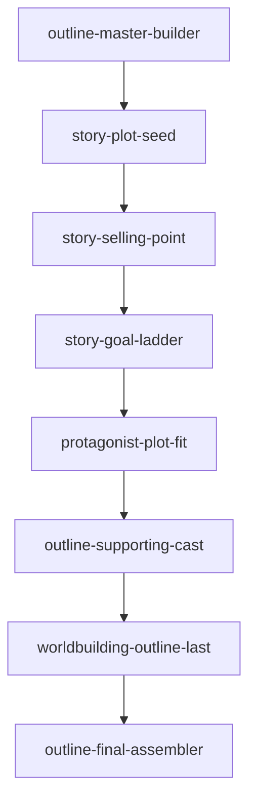

# 大纲如何写 - Skill 索引

## 调用顺序

1. `outline-master-builder`：主控流程，负责调度所有步骤。
2. `story-plot-seed`：生成 500 字剧情骨架。
3. `story-selling-point`：提炼核心卖点。
4. `story-goal-ladder`：设计阶段目标。
5. `protagonist-plot-fit`：让主角人设服务剧情。
6. `outline-supporting-cast`：按主角缺口配置配角。
7. `worldbuilding-outline-last`：最后补世界观。
8. `outline-final-assembler`：合并为完整大纲，并检查黄金三章准备度。

## 依赖关系

## 安装说明

当前文件先生成在 `books/大纲如何写/` 下供检查。确认后可复制各 skill 文件夹到 `C:\Users\Administrator\.codex\skills`。

