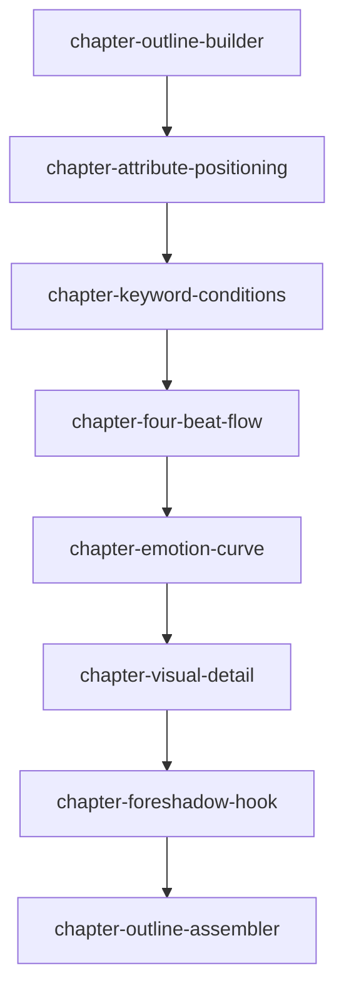

# 章纲技能索引

## 标准模板

所有单章章纲输出必须优先遵循 `CHAPTER_OUTLINE_STANDARD.md`。旧称“细纲”的单章文件统一按“章纲”处理，文件命名使用 `章纲-第001章.md`。

## 调用顺序

1. `chapter-outline-builder`：章纲总控，负责按顺序调度所有步骤。
2. `chapter-attribute-positioning`：确定本章情绪标签、章节属性和推进功能。
3. `chapter-keyword-conditions`：确定浓缩剧情、关键词、必要条件和必须插入的信息。
4. `chapter-four-beat-flow`：拆成开篇入戏、中段冲突、核心爆点、强钩收尾。
5. `chapter-emotion-curve`：设计本章情绪起伏，避免全章平或全章炸。
6. `chapter-visual-detail`：补环境、动作、信息暗线细节，让章节有画面。
7. `chapter-foreshadow-hook`：回收旧伏笔、预埋新伏笔、设置结尾强钩子。
8. `chapter-outline-assembler`：合并为可写作的完整章纲。

## 依赖关系

## 核心原则

大纲解决整本书往哪里走；章纲解决这一章怎么让读者留下来。每一章都必须有定位、有变化、有看点、有画面、有钩子。

完整章纲还必须包含上章承接、核心事件因果链、关键信息与扩写方式、角色状态变化、设定/道具更新、下一章交接和写作约束，避免后续 AI 会话写正文时只拿到简版摘要。

## 使用建议

- 用户只给一个灵感时，先用 `chapter-outline-builder` 总控，按顺序补齐缺失信息。
- 用户已经有章节定位时，可以从 `chapter-keyword-conditions` 开始。
- 用户只说“这一章太平”，优先用 `chapter-emotion-curve` 和 `chapter-four-beat-flow` 修节奏。
- 用户只说“没有画面”，优先用 `chapter-visual-detail`。
- 用户只说“结尾留不住人”，优先用 `chapter-foreshadow-hook`。
- 最终交付前必须用 `chapter-outline-assembler` 汇总，避免只得到零散组件。
